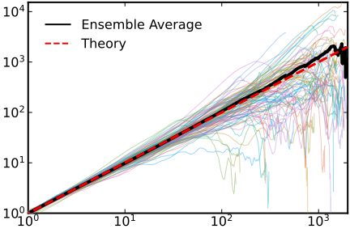

# MeanSquaredDisplacement

[](https://github.com/mastrof/MeanSquaredDisplacement.jl/actions/workflows/CI.yml?query=branch%3Amain)

MeanSquaredDisplacement.jl provides Julia functions (`imsd` and `emsd`) to compute the
mean squared displacement (MSD) of timeseries.

`imsd` is used to evaluate the MSD of individual timeseries,
while `emsd` evaluates ensemble averages.

For short timeseries, the MSD is computed using a plain correlation algorithm
(as implemented in StatsBase.jl) with complexity O(N^2), while for larger samples,
an FFT-based fast correlation algorithm is used, with complexity O(NlogN).
This ensures good performance for all sample sizes.

The MSD of non-scalar timeseries can also be evaluated
(equivalent to summing the MSD of each scalar element), but it's not yet optimized.


## MSD of a single timeseries
```julia
using MeanSquaredDisplacement
x = cumsum(randn(10000))
imsd(x)
```

## Individual MSD of multiple timeseries
```julia
using MeanSquaredDisplacement
x = cumsum(randn(10000, 100))
imsd(x) # evaluates MSD along columns
```

## MSD of uneven timeseries
```julia
using MeanSquaredDisplacement
N = 100
Tmin, Tmax = 100, 2000
# trajectories of random length between Tmin and Tmax
x = [cumsum(randn(rand(Tmin:Tmax))) for _ in 1:N]
iM = imsd.(x)
eM = emsd(x)
```

